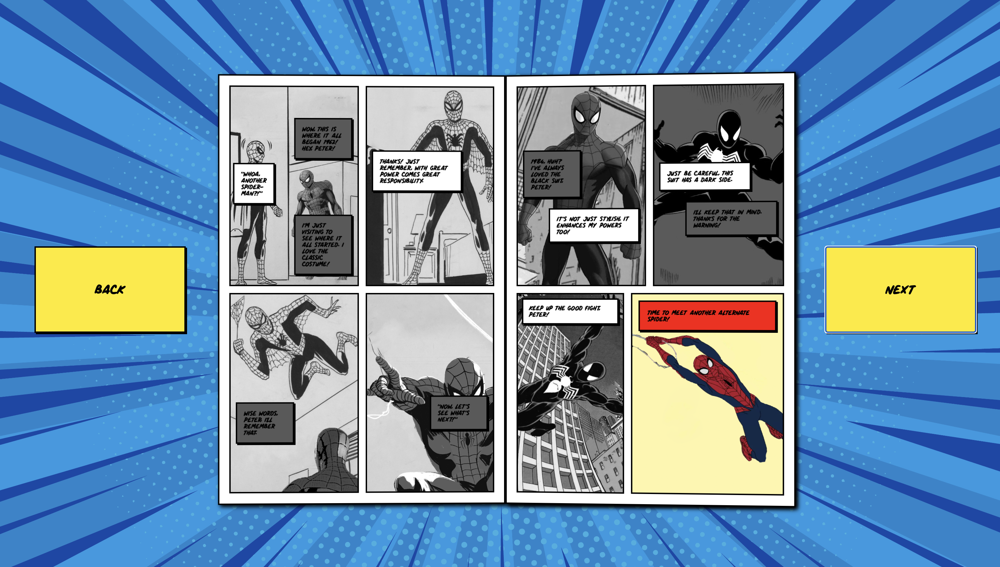

# Procesverslag
Markdown is een simpele manier om HTML te schrijven.  
Markdown cheat cheet: [Hulp bij het schrijven van Markdown](https://github.com/adam-p/markdown-here/wiki/Markdown-Cheatsheet).

Nb. De standaardstructuur en de spartaanse opmaak van de README.md zijn helemaal prima. Het gaat om de inhoud van je procesverslag. Besteedt de tijd voor pracht en praal aan je website.

Nb. Door *open* toe te voegen aan een *details* element kun je deze standaard open zetten. Fijn om dat steeds voor de relevante stuk(ken) te doen.

## Jij

### Ontwerper:
Salentino Bommel

#### Je startniveau:
rood

# Je plan

  
De eerste versie/schets van je ontwerp & je persoonlijke uitdaging

  ### De eerste versie/schets:
  

  ### Je ambitie: 
  Aan deze technieken/punten wil ik werken:
  - Flex
  - Layout
  - Interactie
 

## Voortgang/Feedback 1

  
Mijn bevindingen + wijzigingen (minimaal 5)

  ### Bevinding 1:
  
   Flex werkte niet echt doordat panels uit beeld gingen

  #### oplossing:
    bereken hoeveel ruimte ze beide nodig haden en niet boven 100 komen

  ### Bevinding 2:
  Boek omslaan 

  #### oplossing:
  Uiteindelijk opgelost met een opacity die op 1 axis spiegelt

  ### Bevinding 3:
  

## Voortgang/Feedback 2

  
Mijn bevindingen + wijzigingen (minimaal 5)

  
  ### Bevinding 1:
  Boek omslaan kan op een betere manier

  #### oplossing:
  Code van Sanne gebruikt om dubbelzijdig papier te maken

  ### Bevinding 2:
  Boek omslaan op basis van klik op knop
  #### oplossing:
  Functies overzetten in click script.

  ### Bevinding 3:
  
   

## Voortgang/Feedback 3

 
  ### Bevinding 3:
  Alex feedback
  A veranderen in Ps
  Comments toevoegen per onderdeel
  Achtefrond toevoegen en minder druk
  Texture comic
  Pointer to spiderman  

## Reflectie

  
Mijn eindresultaat & persoonlijke ontwikkeling

  ### Je uitkomst - karakteristiek screenshot(s):
  

  ### Dit ging goed/Heb ik geleerd: 
  Ik heb geleerd om goed op te letten welke code andere code beinvloeden en daarbij de juiste javascript toe te passen. 
  Naast de code is het coderen ook best goed gegaan omdat je meerdere studenten naast je hebt die kunnen helpen of met nieuwe ideeen kunnen komen.

## Bronnenlijst

continu bijhouden terwijl je werkt

Nb. Wees specifiek ('css-tricks' als bron is bijv. niet specifiek genoeg).

1. https://www.google.com/url?sa=i&url=https%3A%2F%2Fbeyondamazingexhibition.com%2F&psig=AOvVaw0yo4bCbndOWaMY0LSOfI4W&ust=1683641356382000&source=images&cd=vfe&ved=0CAQQjB1qFwoTCLDeyPny5f4CFQAAAAAdAAAAABAI
2. https://www.theblotsays.com/2019/10/spider-man-into-spider-verse-timed.html
3. https://www.tcj.com/a-holy-grail-in-the-library-of-congress-visiting-steve-ditkos-amazing-fantasy-15-original-artwork/
4. https://www.marvel.com/articles/comics/margaret-stohl-on-the-gritty-group-jam-behind-spider-man-noir-1
5. https://www.chasingamazingblog.com/2015/03/02/review-spider-gwen-1-and-the-first-step-of-hopefully-many/

